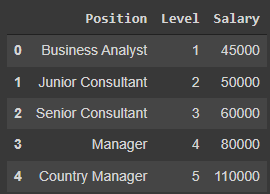
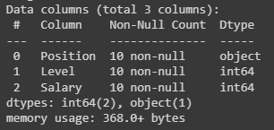
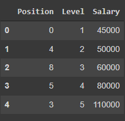
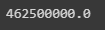
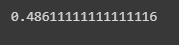
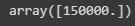

# Implementation-of-Decision-Tree-Regressor-Model-for-Predicting-the-Salary-of-the-Employee

## AIM:
To write a program to implement the Decision Tree Regressor Model for Predicting the Salary of the Employee.

## Equipments Required:
1. Hardware – PCs
2. Anaconda – Python 3.7 Installation / Moodle-Code Runner

## Algorithm
1. Import pandas library to read csv or excel file.
2. Import LabelEncoder using sklearn.preprocessing library.
3. Transform the data's using LabelEncoder.
4. Import decision tree regressor from sklearn.tree library to predict the values.
5. Find Mean squared error and r2.
6. Predict the values.
7. End of the program.

## Program:
```
/*
Program to implement the Decision Tree Regressor Model for Predicting the Salary of the Employee.
Developed by: S.ABHISHEK
RegisterNumber:  212221230002
import pandas as pd
data=pd.read_csv("Salary.csv")
data.head()
data.info()
data.isnull().sum()
from sklearn.preprocessing import LabelEncoder
le=LabelEncoder()
data["Position"]=le.fit_transform(data["Position"])
data.head()
x=data[["Position","Level"]]
y=data["Salary"]
from sklearn.model_selection import train_test_split
x_train,x_test,y_train,y_test=train_test_split(x,y,test_size=0.2,random_state=2)
from sklearn.tree import DecisionTreeRegressor
dt=DecisionTreeRegressor()
dt.fit(x_train,y_train)
y_pred=dt.predict(x_test)
from sklearn import metrics
mse=metrics.mean_squared_error(y_test,y_pred)
mse
r2=metrics.r2_score(y_test,y_pred)
r2
dt.predict([[5,6]])
*/
```

## Output:
### data.head()


### data.info()


### data.head() using label encoder


### MSE


### r2



## PREDICTION



## Result:
Thus the program to implement the Decision Tree Regressor Model for Predicting the Salary of the Employee is written and verified using python programming.
